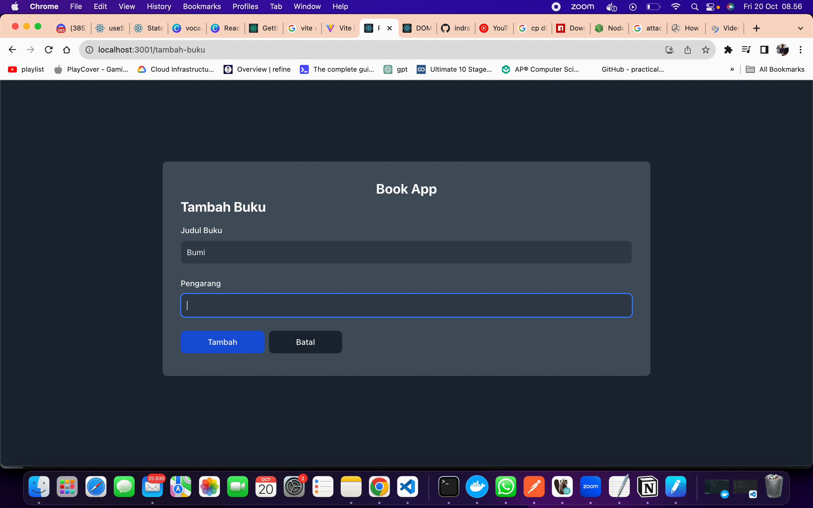

# Release-1

## Working with forms

Pada Release ini, kalian hanya berfokus untuk membuat fungsi pada form

### Keterangan:
1. Form terdiri dari dua komponen untuk field input Judul buku dan pengarang
2. Terdapat dua button, yaitu `Submit` dan `Batalkan`
3. Arahkan `Url` pada browser secara manual terlebih dahulu dengan menambahkan `/tambah-buku`.
contoh: `http://localhost:3000/tambah-buku` 

### Ekspektasi Output Program
1. Form bisa menyimpan value dari input user, dan tampilkan pada `alert` saat user menekan button

2. Form harus divalidasi, ketika form kosong, maka `alert` akan muncul untuk memberitahu user bahwa form belum terisi.

